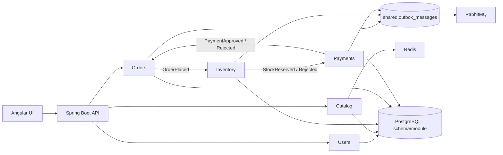

# Java E-commerce Modular Monolith

Laboratorio vertical em Java 25, Spring Boot 4.1, Spring Modulith e Angular 22.1. O objetivo nao e simular um produto inteiro: e tornar demonstraveis limites modulares, consistencia eventual, idempotencia, seguranca e operabilidade em um checkout compacto.

## Fluxo demonstrado

1. Um administrador cria um produto e ajusta o estoque.
2. Um cliente envia `POST /api/v1/orders` com `Idempotency-Key` e recebe `202 Accepted`.
3. Orders grava pedido e evento na mesma transacao da Outbox.
4. Inventory reserva com lock pessimista e Inbox; Payments aprova ou rejeita deterministicamente.
5. Orders confirma ou cancela. Falha de pagamento libera a reserva.
6. A Outbox espelha os eventos no exchange RabbitMQ `ecommerce.events` com entrega at-least-once.



## Modulos e decisoes

- `users`: JWT HMAC, BCrypt, RBAC (`ADMIN`/`CUSTOMER`) e identidade persistida.
- `catalog`: produtos e cache read-through Redis com invalidacao em escrita.
- `inventory`: estoque disponivel/reservado, lock pessimista e comando idempotente.
- `orders`: command de checkout, query protegida por ownership e estado explicito.
- `payments`: gateway fake deterministico; totais a partir de `5000.00` sao rejeitados.
- `shared`: contratos de eventos, Outbox/Inbox, correlation ID e Problem Details.

Spring Modulith e os testes estruturais impedem ciclos e dependencias fora dos contratos publicos. O PostgreSQL possui schemas `users`, `catalog`, `inventory`, `orders`, `payments` e `shared`, criados por Flyway. Consulte [ADR-0001](docs/adr/0001-modular-monolith.md) e [ADR-0002](docs/adr/0002-eventual-checkout.md).

## Executar

Requisitos locais: Docker Compose. O caminho completo sobe UI, API e dependencias:

```bash
docker compose up --build
```

- UI: `http://localhost:4200`
- OpenAPI/Swagger: `http://localhost:8080/swagger-ui.html`
- Readiness: `http://localhost:8080/actuator/health/readiness`
- Prometheus: `http://localhost:8080/actuator/prometheus`
- RabbitMQ Management: `http://localhost:15672` (`ecommerce` / `ecommerce`)

Usuarios didaticos: `admin@test.com`, `customer@test.com` e `other@test.com`, todos com senha `Password123!`. Eles existem apenas para a execucao local; troque `JWT_SECRET` e credenciais em qualquer ambiente real.

A UI entra como cliente e consome somente contratos REST reais. Para cadastrar dados, autentique como admin no Swagger, crie um produto e ajuste seu estoque; depois recarregue a UI.

## Verificar

```bash
JAVA_HOME=/opt/homebrew/opt/openjdk@25/libexec/openjdk.jdk/Contents/Home ./mvnw verify
PATH=/opt/homebrew/opt/node@24/bin:$PATH npm --prefix frontend ci
PATH=/opt/homebrew/opt/node@24/bin:$PATH npm --prefix frontend run test:ci
PATH=/opt/homebrew/opt/node@24/bin:$PATH npm --prefix frontend run build
docker compose config --quiet
```

`CheckoutFlowTest` valida happy path, estoque insuficiente, pagamento rejeitado, idempotencia, RBAC e ownership pelo seam HTTP. `InfrastructureTest` usa Testcontainers para PostgreSQL, Redis e RabbitMQ reais e e ignorado apenas se Docker nao existir. `ArchitectureTest` verifica os limites Spring Modulith.

## Operacao e entrega

Logs incluem `X-Correlation-ID`; Actuator publica health, metricas e Prometheus; Micrometer Tracing prepara propagacao OTEL. Docker usa runtime sem root. GitHub Actions executa o pipeline principal, enquanto `Jenkinsfile` e `.gitlab-ci.yml` demonstram equivalencia. `infra/kubernetes` contem Deployment, Service, ConfigMap e Secret; `infra/openshift` acrescenta Route TLS.

Em entrevista, os trade-offs centrais sao: um deploy em troca de limites verificados, consistencia eventual em troca de XA, entrega at-least-once em troca de Inbox, e cache descartavel mantendo PostgreSQL como fonte de verdade.
